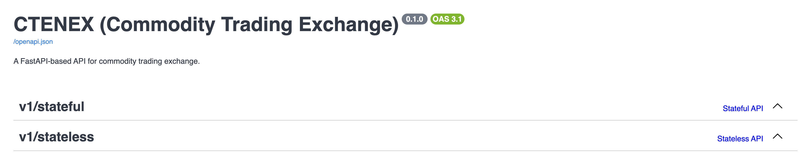

# ctenex

Simple educational energy commodity trading exchange.

This project was originally created by [Jordan Dimov](https://github.com/jordan-dimov) as one
of the projects of his **Commodity Trading** course. This is a fork to highlight my
own implementation of the concepts Jordan has taught me about trading exchanges.

## Implementations

The API serves two basic implementations that accept incoming limit and market orders for a
given contract and generate trades as these are matched.

The first implementation is a stateful in-memory one that is meant to introduce to the basic
operating concepts of the exchanges. Once an order is placed, a match is attempted and any generated
trades are recorded. Any filled orders are removed from the memory.

The second implementation is a stateless one that uses Postgres to persist both orders and trades
in a `book` schema. This is the version that is closer to a real-world application.

Once an order is placed:

1. a match is attempted
2. the order is persisted
3. the generated trades (if any) are persisted, in which case,
4. any affected orders are updated.

The database schema can be found [here](./docs/database.md).

## Development

To learn how to use the dev tools available, see the [Dev Tools section](./docs/dev-tools.md)
