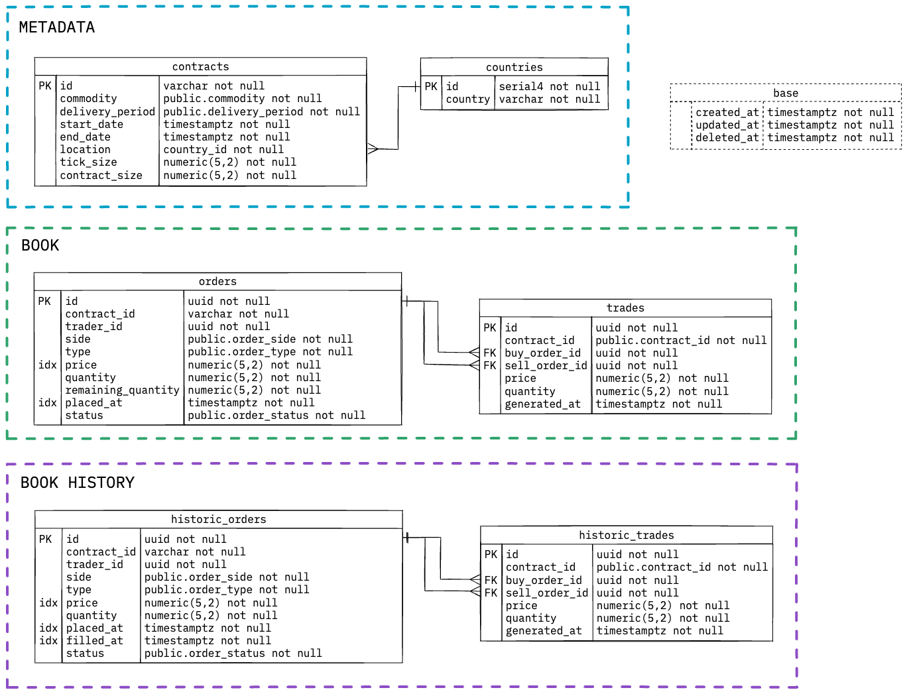

The database schema
====================

There are 3 Postgres schemas: `metadata`, `book` and `history`.

- **Metadata** is meant to contain all things related to the configuration.
For now, a symbolic list of contracts and countries they belong to.

- **Book** contains the tables that provide the core business logic: `orders`
and `trades`. See the core behaviour explanation [here]().

- **History** is meant to represent the entry point for data pipelines that operate
on the historic data; for instance to support business analysts interested in the
historic market movements happening in the exchange, etc.

In general, it should also provide a mechanism to offload the main `book` tables so
that the exchange can operate on the relevant data only (e.g. if the orders are too
old, they are moved out).

